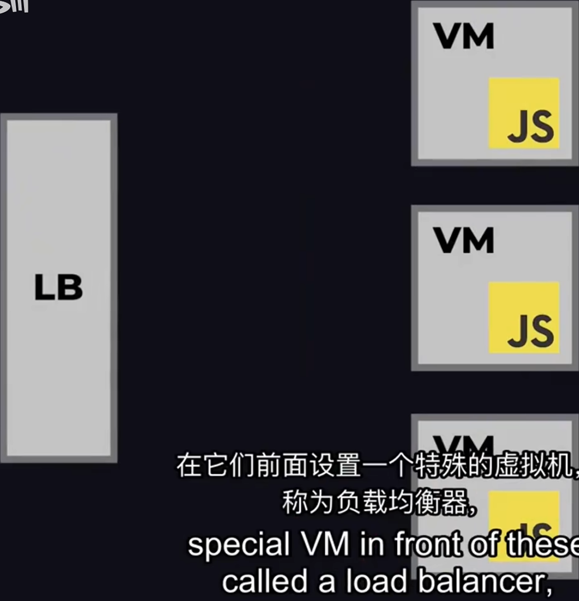

# 软件开发浅了解

## 后端开发

- 用开发语言——>>大量代码——>>两种工具：**后端框架和包管理器**
    1. 后端框架：Java+Spring Boot ；Python+Django ； Go+Gin
    2. 包：常见任务：计算、与数据库通信、设置用户登录和身份验证 
    3. 包管理器：Java--Maven ； Python--Pip
- API——允许一个组件（如前端）和另一个组件（如后端）进行交互
- 数据过大——云计算——PA的服务
  
- 微服务——将后端分成单独的后端——使代码库更小更集中（不同的代码库可以不用相同的语言）
- Saas服务——提供外部应用程序可以使用的后端和API
- laaS服务——基础设施即服务
- PaaS服务——平台即服务